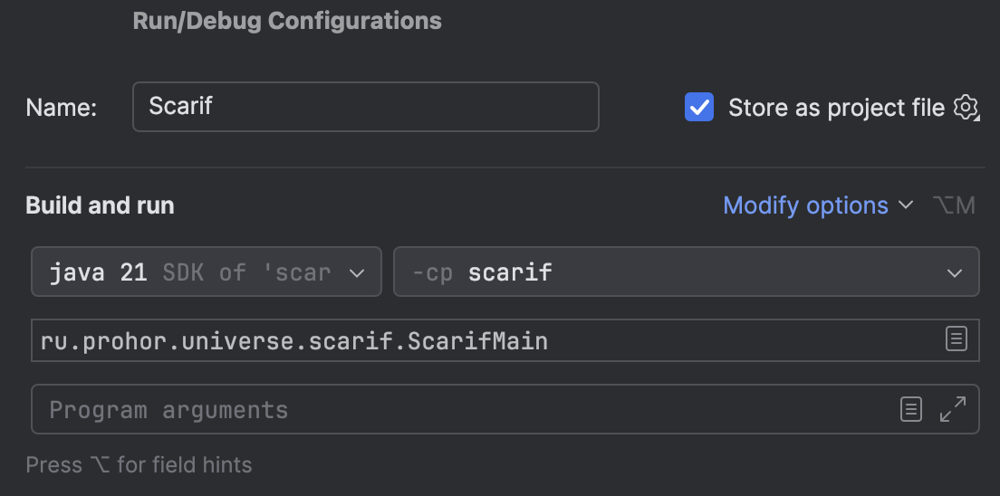

# Jawa


`Jawa` - это maven-проект для всего java и kotlin кода.
Назван в честь гуманоидов с планеты Татуин из-за созвучности
с языком java.

Для разработки в IDE открывать как проект стоит именно папку jawa,
а не весь репозиторий.

### Настройка IntelliJ IDEA

##### Code Style

Настройки стиля кода хранятся в репозитории, поэтому,
для их использования, надо включить настройку:

```
Setting -> Editor -> Code Style -> Scheme -> Project
```

##### Run configurations

Конфигурации запуска хранятся в `.idea/runConfigurations`.
Со временем их может стать много, поэтому можно пользоваться
сочетанием `^ + ^` (`ctrl + ctrl`), которое открывает меню
конфигураций запуска.

При создании новой конфигурации, необходимо прожать галочку
`store as project file`, чтобы конфигурация была доступна
в репозитории:


